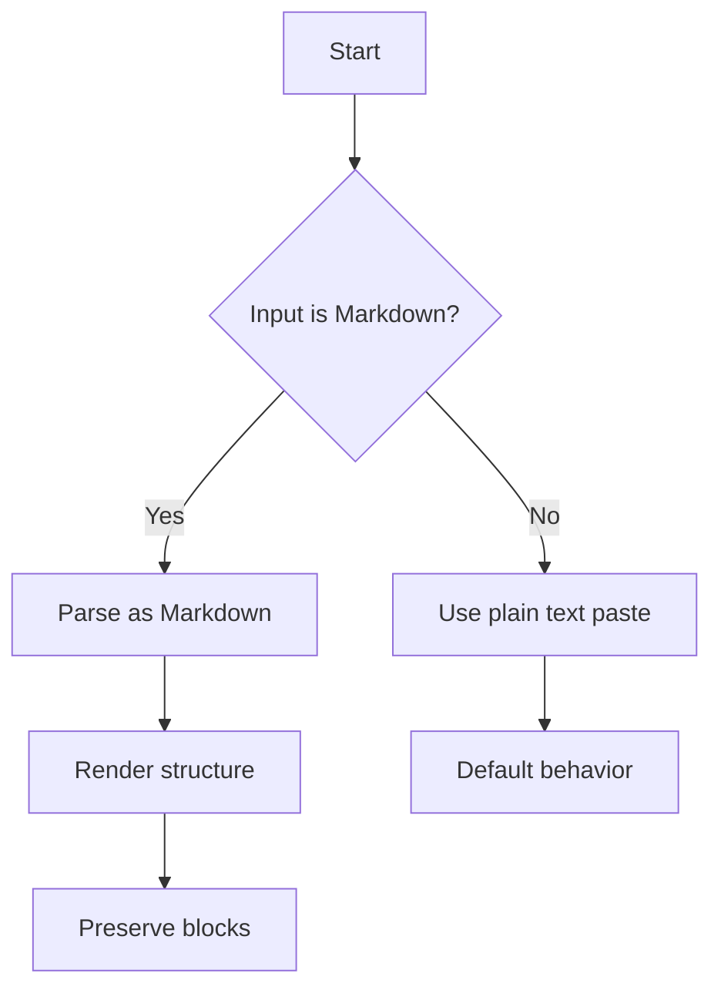
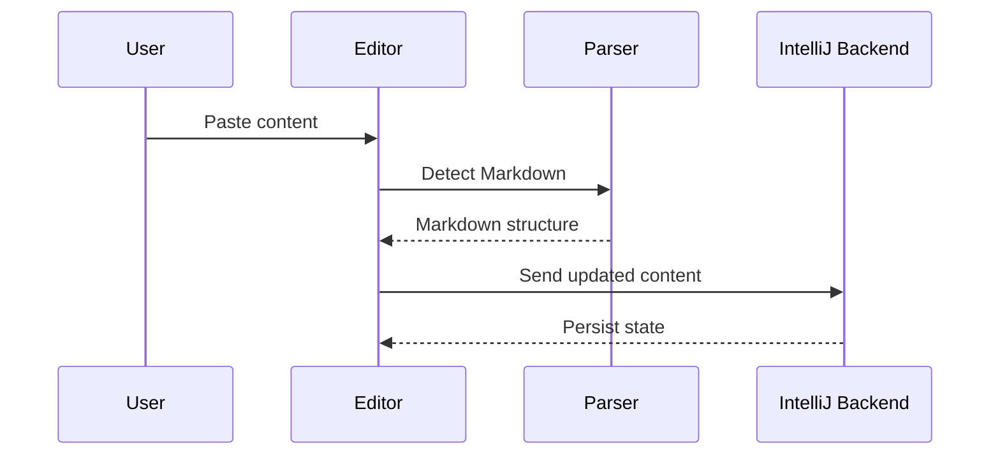
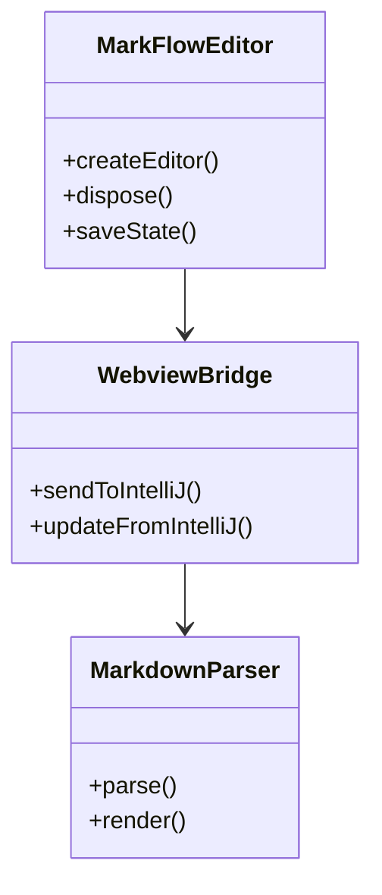
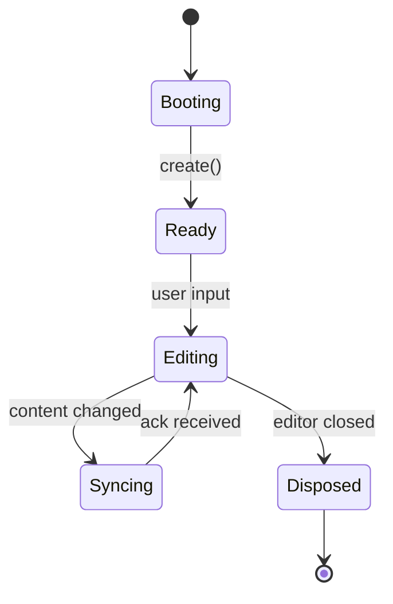
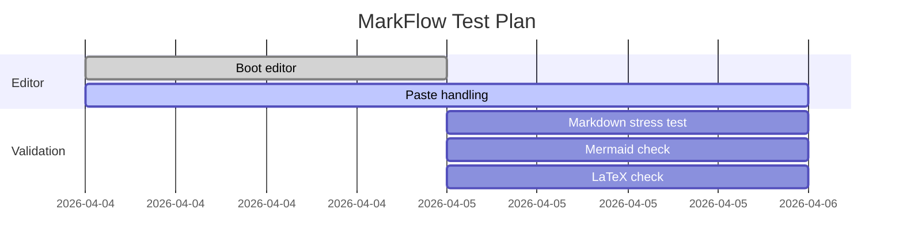
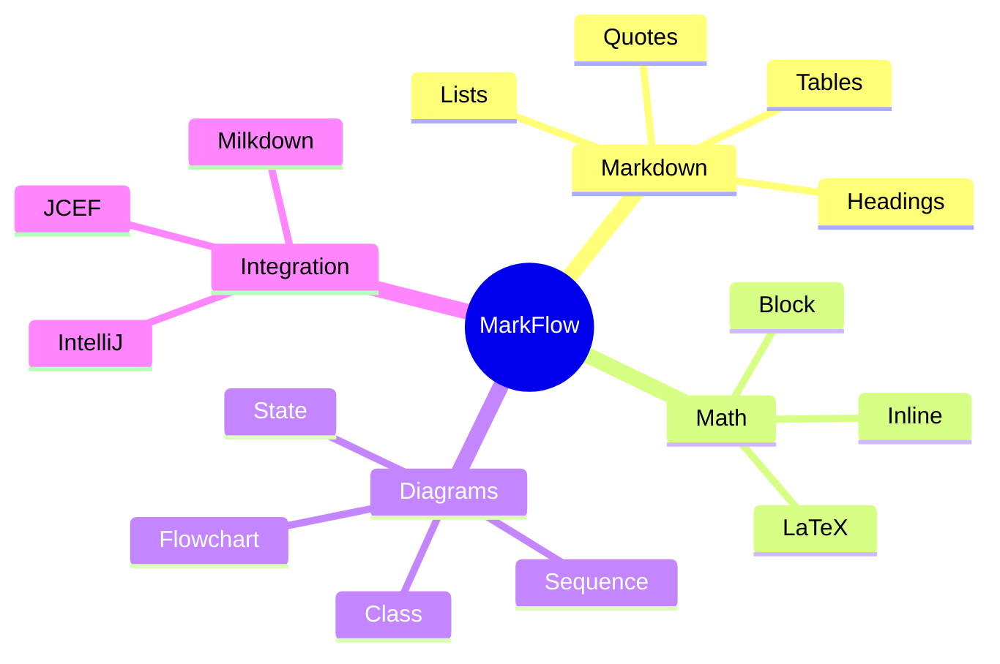

# MarkFlow Markdown Stress Test

This document is meant to test:

- Markdown headings
- Lists and nested lists
- Tables
- Blockquotes
- Code fences
- Inline and block LaTeX
- Mermaid diagrams
- Mixed content and paste behavior

For a minimal Mermaid sanity check, see `mermaid-minimal.md`.

---

## 1. Basic Markdown

### 1.1 Paragraphs

MarkFlow should preserve normal paragraphs, line breaks, and emphasis.

This is a paragraph with **bold**, *italic*, ***bold italic***, and `inline code`.

You can also test escaped characters:

\* literal asterisk \*
\_ literal underscore \_
\\ backslash

### 1.2 Lists

- Item 1
- Item 2
    - Nested item 2.1
    - Nested item 2.2
        - Nested item 2.2.1
- Item 3

1. First
2. Second
    1. Sub-item
    2. Sub-item
3. Third

- [x] Completed task
- [ ] Pending task
- [ ] Another pending task

> Blockquote level 1
>
> > Blockquote level 2
> >
> > - Nested bullet in quote
> > - Another bullet
>
> Back to level 1

---

## 2. Tables

| Column A | Column B | Column C |
|----------|----------|----------|
| A1       | B1       | C1       |
| A2       | B2       | C2       |
| A3       | B3       | C3       |

| Syntax | Example | Notes |
|--------|---------|------|
| Inline code | `code` | monospace |
| Bold | **text** | strong emphasis |
| Math | $a^2+b^2=c^2$ | inline math |

---

## 3. Inline LaTeX

Here is inline math:

- $E = mc^2$
- $a^2 + b^2 = c^2$
- $\alpha + \beta + \gamma = \pi$
- $\int_0^1 x^2 \, dx = \frac{1}{3}$

You can also mix math with text:
The quadratic formula is $x = \frac{-b \pm \sqrt{b^2 - 4ac}}{2a}$.

---

## 4. Block LaTeX

$$
\int_0^\infty e^{-x^2}\,dx = \frac{\sqrt{\pi}}{2}
$$

$$
\frac{d}{dx}\left(\sin x\right) = \cos x
$$

$$
\sum_{k=1}^{n} k = \frac{n(n+1)}{2}
$$

$$
\begin{aligned}
f(x) &= x^2 + 2x + 1 \\
&= (x+1)^2
\end{aligned}
$$

$$
\begin{aligned}
\nabla \cdot \mathbf{E} &= \frac{\rho}{\varepsilon_0} \\
\nabla \cdot \mathbf{B} &= 0
\end{aligned}
$$

---

## 5. Mermaid Flowchart



---

## 6. Mermaid Sequence Diagram



---

## 7. Mermaid Class Diagram



---

## 8. Mermaid State Diagram



---

## 9. Mermaid Gantt Chart



---

## 10. Mermaid Mindmap



---

## 11. Nested Mixed Content

### 11.1 Ordered list with math and code

1. Parse markdown
2. Preserve structure
3. Render diagrams
4. Keep code blocks intact

Example:

```ts
function greet(name: string) {
    return `Hello, ${name}!`;
}
```

Mathematics inside list item: $f(x) = x^2$

### 11.2 Bullet list with blockquote

- First bullet
  > Nested quote
  >
  > - Quote bullet
  > - Quote bullet 2
- Second bullet

---

## 12. Horizontal Rules

---

***

---

## 13. Reference Links

This is a [link to the Markdown Guide](https://www.markdownguide.org/).

This is a [link to JetBrains IntelliJ Platform docs](https://plugins.jetbrains.com/docs/intellij/welcome.html).

---

## 14. Footnote-style text

A sentence with a note.[^1]

[^1]: This is a footnote-like reference for parser stress testing.

---

## 15. HTML-like edge cases

Use these to see how the editor handles literal angle brackets:

<https://example.com>
<custom-tag>literal text</custom-tag>

---

## 16. Final Mixed Stress Block

### Checklist

- [x] Headings
- [x] Lists
- [x] Tables
- [x] Inline math
- [x] Block math
- [x] Mermaid diagrams
- [x] Code fences
- [x] Quotes

### Final formula

$$
\boxed{
\lim_{n \to \infty}\left(1 + \frac{1}{n}\right)^n = e
}
$$

### Final note

If this document pastes correctly, then Markdown structure, LaTeX, Mermaid, and code preservation are all working as
intended.
