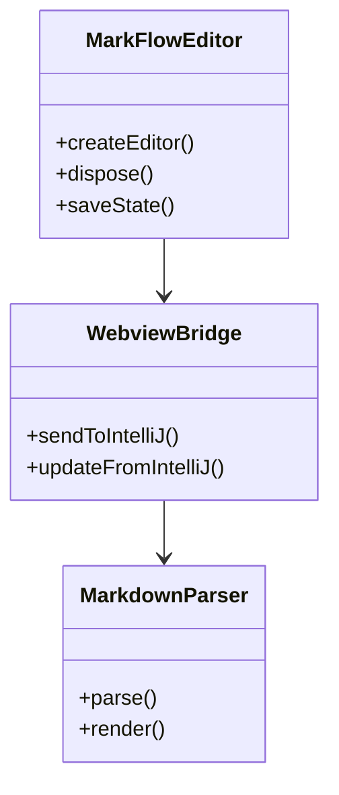

# Mermaid Class Diagram Example

```mermaid
classDiagram
    class MarkFlowEditor {
      +createEditor()
      +dispose()
      +saveState()
    }

    class WebviewBridge {
      +sendToIntelliJ()
      +updateFromIntelliJ()
    }

    class MarkdownParser {
      +parse()
      +render()
    }

    MarkFlowEditor --> WebviewBridge
    WebviewBridge --> MarkdownParser
```

