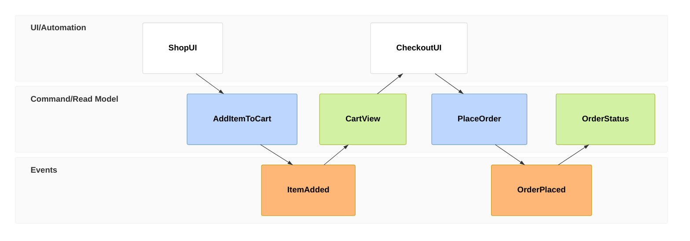

# Mermaid eventmodeling diagram

Upstream: `mermaid-js/mermaid mermaid@12.1.0 packages/examples/src/examples/eventmodeling.ts`

```mermaid
eventmodeling

tf 01 ui ShopUI
tf 02 cmd AddItemToCart
tf 03 evt ItemAdded
tf 04 rmo CartView ->> 03
tf 05 ui CheckoutUI
tf 06 cmd PlaceOrder
tf 07 evt OrderPlaced
tf 08 rmo OrderStatus ->> 07
```
