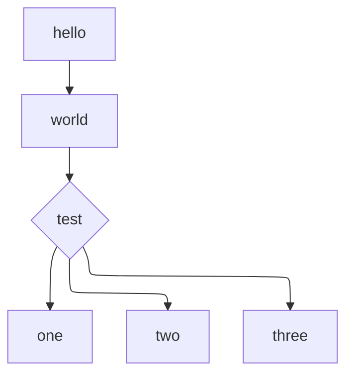

# Mermaid flowchart-elk diagram

Upstream: `mermaid-js/mermaid mermaid@12.1.0 e2e/platform/flow-elk.html`

```mermaid
flowchart-elk
a[hello] --> b[world]
b --> c{test}
c --> one
c --> two
c --> three
```
