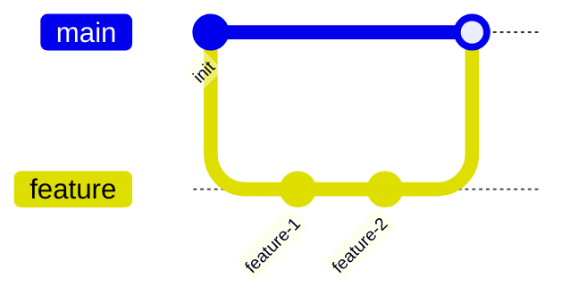

# Mermaid Git Graph Example

```mermaid
gitGraph
    commit id:"init"
    branch feature
    checkout feature
    commit id:"feature-1"
    commit id:"feature-2"
    checkout main
    merge feature
```

