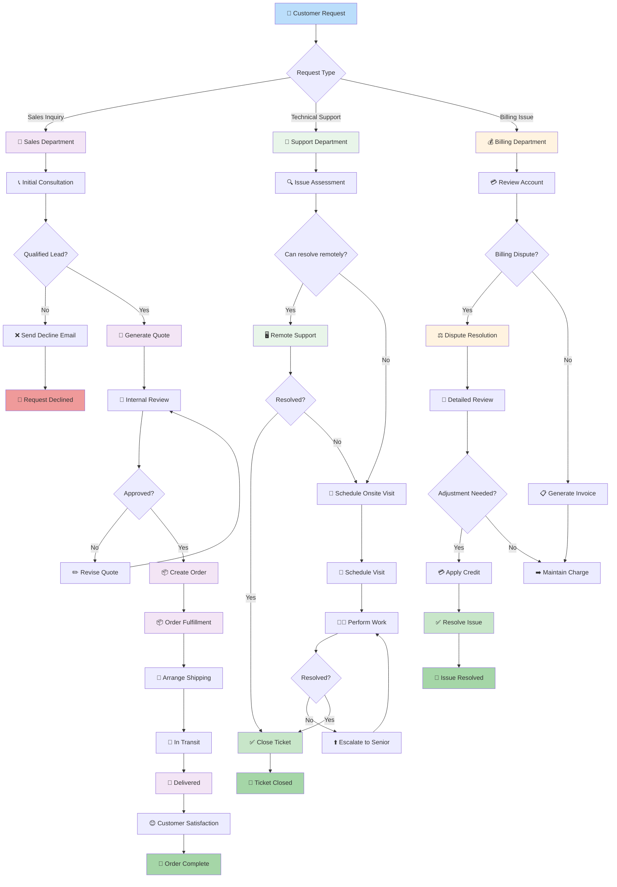

# Large Mermaid Flowchart Example

This is a comprehensive example demonstrating a large and wide flowchart that benefits from the different diagram size modes.

## Software Development Workflow

```mermaid
flowchart LR
    A["📋 Project Initiation"] --> B["👥 Team Meeting"]
    B --> C["📝 Requirement Gathering"]
    C --> D["✓ Requirements Approved"]
    D --> E["🎨 UI/UX Design"]
    E --> F["💻 Frontend Development"]
    E --> G["🔧 Backend API Design"]

    F --> H["🧪 Frontend Unit Tests"]
    G --> I["📊 Database Schema"]
    I --> J["🔌 API Implementation"]
    J --> K["✓ API Code Review"]
    K --> L["🧪 Backend Unit Tests"]

    H --> M["🔗 Integration Phase"]
    L --> M

    M --> N["🐛 Integration Testing"]
    N --> O{Bugs Found?}
    O -->|Yes| P["🔧 Bug Fix"]
    P --> N
    O -->|No| Q["✓ Integration Approved"]

    Q --> R["📱 QA Testing"]
    R --> S["📋 Test Report"]
    S --> T{Pass?}
    T -->|No| U["📝 Issue Log"]
    U --> P
    T -->|Yes| V["🚀 Release Candidate"]

    V --> W["⚙️ Staging Deploy"]
    W --> X["🔍 Staging Verification"]
    X --> Y{Ready?}
    Y -->|No| Z["🔧 Last Minute Fixes"]
    Z --> W
    Y -->|Yes| AA["✅ Production Deploy"]

    AA --> AB["📊 Monitoring"]
    AB --> AC{Issues?}
    AC -->|Critical| AD["🚨 Hotfix"]
    AD --> AE["🔄 Redeploy"]
    AE --> AB
    AC -->|No| AF["📈 Release Success"]

    AF --> AG["📚 Documentation"]
    AG --> AH["🎉 Release Complete"]

    style A fill:#e1f5ff
    style D fill:#c8e6c9
    style Q fill:#c8e6c9
    style V fill:#fff9c4
    style AA fill:#ffe0b2
    style AF fill:#c8e6c9
    style AH fill:#a5d6a7
    style O fill:#ffccbc
    style T fill:#ffccbc
    style Y fill:#ffccbc
    style AC fill:#ffccbc
```

---

## Complex Business Process

---

## Use This Example To Test Diagram Sizes

1. **FIT_TO_VIEWPORT**: The entire diagram is scaled to fit within your viewport width
2. **SHRINK_TO_FIT**: If the diagram is wider than your viewport, it shrinks to fit; otherwise displays at actual size
3. **ACTUAL_SIZE_SCROLL**: Displays at actual rendered size with scrollbars when needed

Try switching between different size modes in the MarkFlow settings to see how the diagram rendering changes!

---

## Tips for Using Large Diagrams

- **For FIT_TO_VIEWPORT**: Best for getting an overview of the entire workflow
- **For SHRINK_TO_FIT**: Good balance between detail and fitting in the viewport
- **For ACTUAL_SIZE_SCROLL**: Best when you need to see details and don't mind scrolling around

