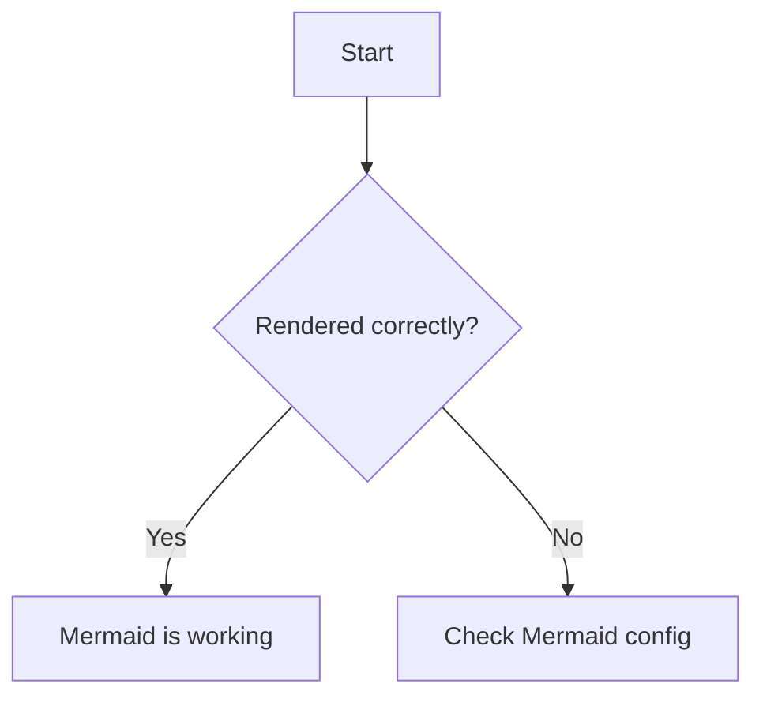

# Mermaid Minimal Example

A small Mermaid sample for quick rendering checks.

```mermaid
flowchart TD
    A[Start] --> B{Rendered correctly?}
    B -- Yes --> C[Mermaid is working]
    B -- No --> D[Check Mermaid config]
```

