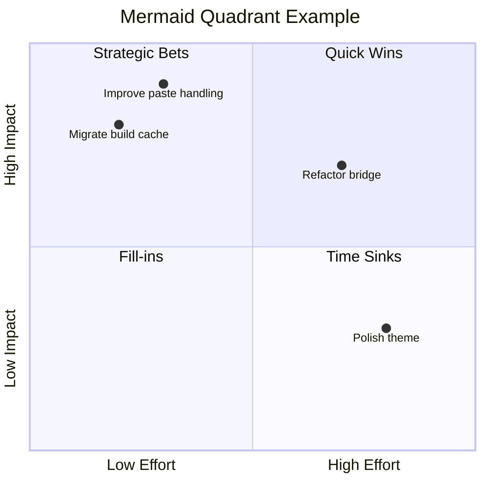

# Mermaid Quadrant Chart Example

```mermaid
quadrantChart
    title Mermaid Quadrant Example
    x-axis Low Effort --> High Effort
    y-axis Low Impact --> High Impact
    quadrant-1 Quick Wins
    quadrant-2 Strategic Bets
    quadrant-3 Fill-ins
    quadrant-4 Time Sinks
    "Migrate build cache": [0.2, 0.8]
    "Improve paste handling": [0.3, 0.9]
    "Refactor bridge": [0.7, 0.7]
    "Polish theme": [0.8, 0.3]
```

