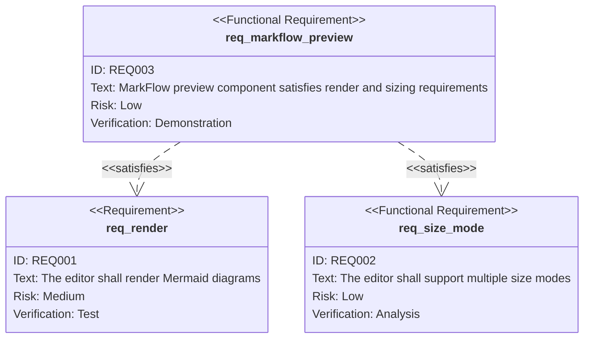

# Mermaid Requirement Diagram Example

```mermaid
requirementDiagram
    requirement req_render {
        id: REQ001
        text: The editor shall render Mermaid diagrams
        risk: medium
        verifymethod: test
    }

    functionalRequirement req_size_mode {
        id: REQ002
        text: The editor shall support multiple size modes
        risk: low
        verifymethod: analysis
    }

    functionalRequirement req_markflow_preview {
        id: REQ003
        text: MarkFlow preview component satisfies render and sizing requirements
        risk: low
        verifymethod: demonstration
    }

    req_markflow_preview - satisfies -> req_render
    req_markflow_preview - satisfies -> req_size_mode
```

