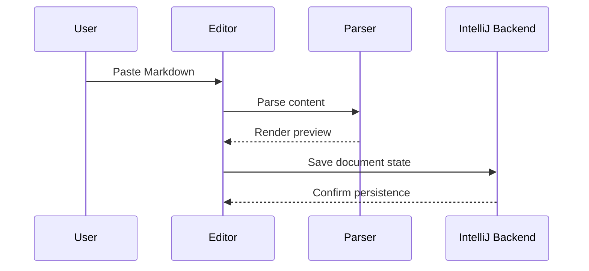

# Mermaid Sequence Diagram Example

```mermaid
sequenceDiagram
    participant U as User
    participant E as Editor
    participant P as Parser
    participant K as IntelliJ Backend

    U->>E: Paste Markdown
    E->>P: Parse content
    P-->>E: Render preview
    E->>K: Save document state
    K-->>E: Confirm persistence
```

