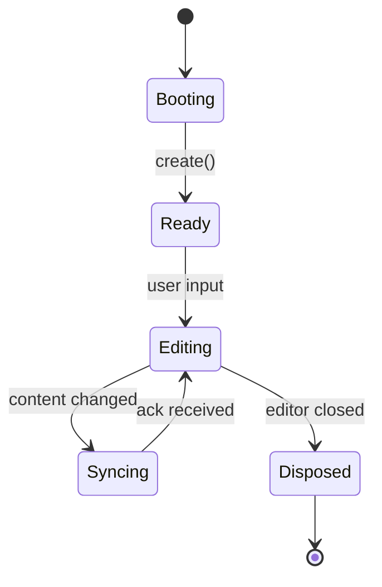

# Mermaid State Diagram Example

```mermaid
stateDiagram-v2
    [*] --> Booting
    Booting --> Ready: create()
    Ready --> Editing: user input
    Editing --> Syncing: content changed
    Syncing --> Editing: ack received
    Editing --> Disposed: editor closed
    Disposed --> [*]
```

