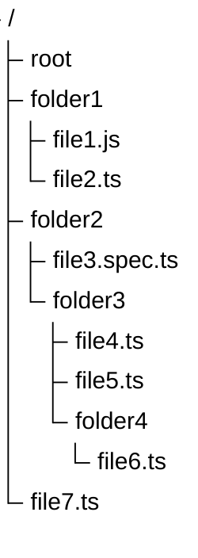

# Mermaid treeview diagram

Source: upstream Mermaid 12.1.0 E2E fixture (`mermaid-js/mermaid@mermaid@12.1.0/e2e/diagrams/tree-view/should-render-a-complex-treeview-diagram-with-quoted-labels.mmd`).

