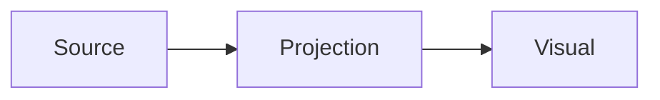

Visual acceptance anchor. Derived renderers must converge without taking source authority.

Inline math remains in prose: $a^2 + b^2 = c^2$.

$$
\int_0^1 x^2\,dx = \frac{1}{3}
$$

A trailing paragraph keeps derived placement surrounded by ordinary Markdown.
